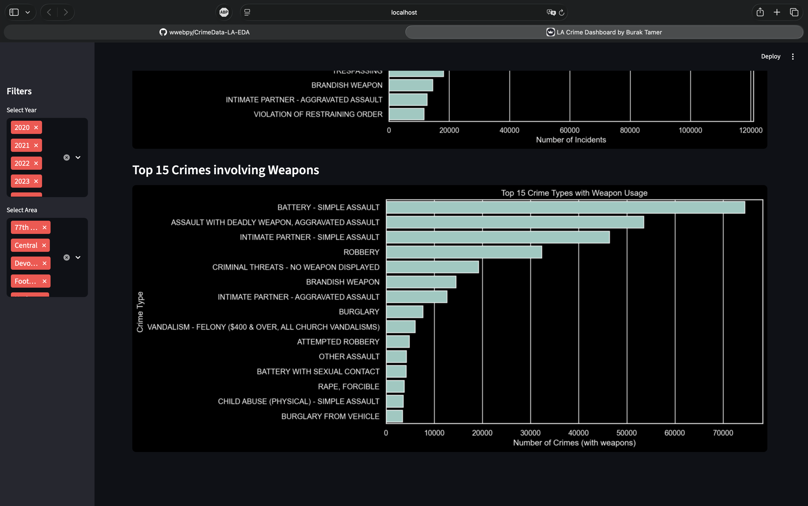
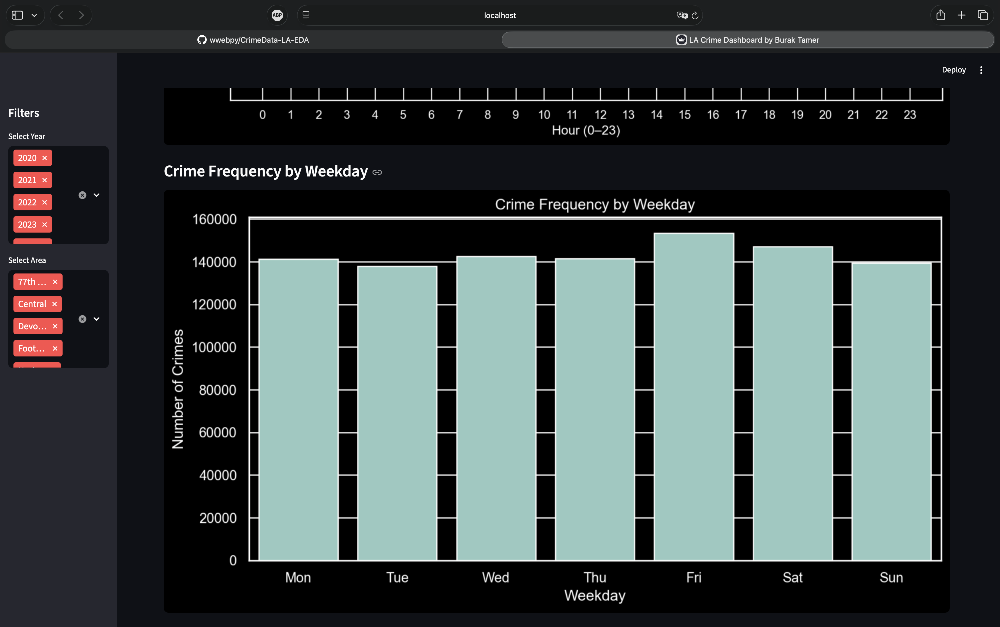
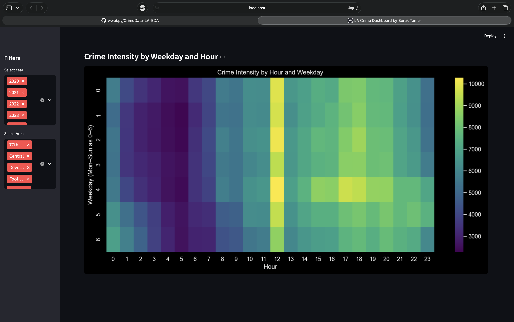
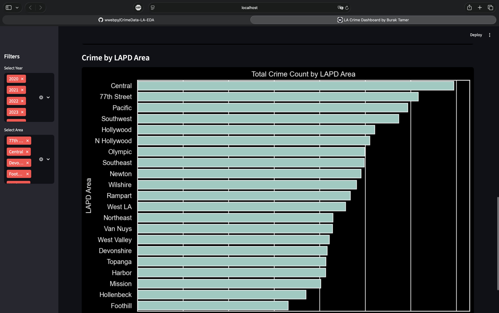
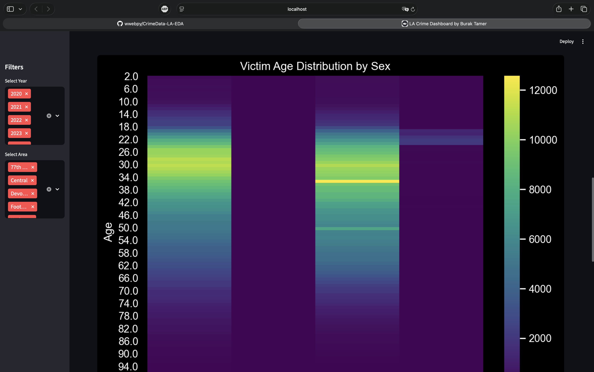
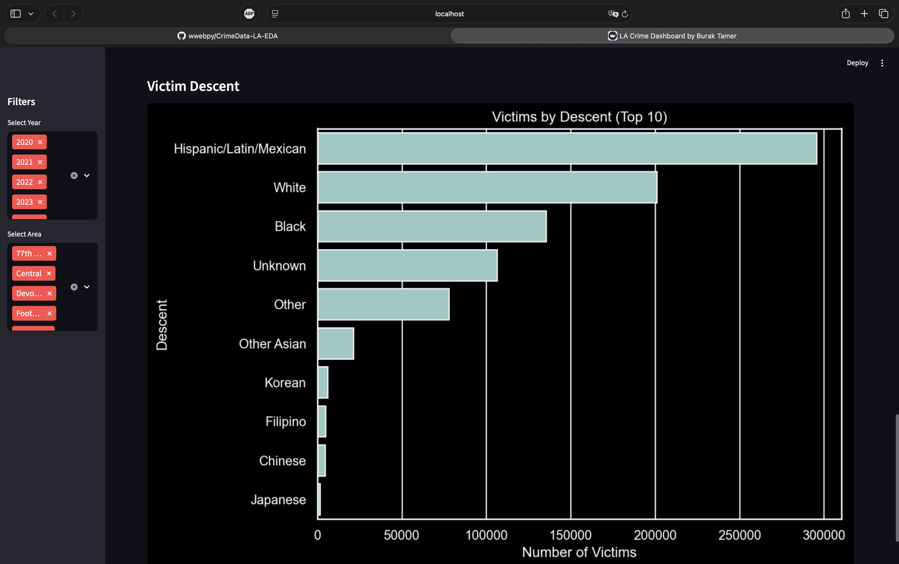

# 🚔 Los Angeles Crime Analysis & Dashboard

Interaktive Analyse von Kriminalitätsdaten der Los Angeles Police Department (LAPD) zwischen 2020 und heute.  
Dieses Projekt kombiniert eine **Explorative Datenanalyse (EDA)** mit einem **interaktiven Streamlit-Dashboard**, um Muster, Trends und Zusammenhänge zu visualisieren.

## 📸 Dashboard Preview

  
  

  
  
  

  
  

  
  
  

---

## 📌 Projektziel

Ziel des Projektes ist es, zentrale Fragen zur Kriminalität in Los Angeles aus einer Datenperspektive zu beantworten:

- Welche Straftaten treten am häufigsten auf?
- Welche Delikte beinhalten den Einsatz von Waffen?
- Wie verteilt sich Kriminalität über **Tageszeit und Wochentag**?
- Wo befinden sich **Hotspots** innerhalb von Los Angeles?
- Welche **Opfergruppen** sind besonders betroffen (Alter, Geschlecht, Herkunft)?

Das Projekt folgt einer typischen **Data-Science-Pipeline**:
**Datenbereinigung → Feature Engineering → EDA → Visualisierung → Dashboard**

---

## 📊 Explorative Datenanalyse (EDA)

Die EDA wurde in Jupyter Notebook durchgeführt und umfasst:

### 🧹 Datenbereinigung
- Entfernen ungültiger Koordinaten (`LAT/LON = 0`)
- Konvertierung von Datumsfeldern
- Umgang mit Nullwerten bei Waffenfeldern
- Mapping von Ethnizitätscodes (`VICT_DESCENT_FULL`)
- Filtern unvollständiger Daten (2024/2025)

### 🧠 Feature Engineering
- `OCC_YEAR`, `OCC_MONTH`, `OCC_WEEKDAY`
- `OCC_HOUR`: Stunde der Tat (0–23)
- `IS_WEEKEND`: Wochenende vs. Wochentag

### 📈 Analysen
- Top-20 Straftaten
- Top-15 Delikte mit Waffe
- Crime-Verteilung über Tagesstunden
- Crime-Verteilung über Wochentage
- Heatmap: Hour × Weekday
- Hotspots auf Kartenbasis (LAT/LON)
- Analyse der Opfer nach Alter, Geschlecht und Herkunft

---

## 🖥️ Dashboard (Streamlit)

Das Dashboard bietet **interaktive Filter**:

- Mehrfachselektion nach Jahr
- Mehrfachselektion nach LAPD-Area

### 🔎 Tabs
- **Crimes Overview**
- **Time Analysis**
- **Location**
- **Victim Profile**

### 🧱 Projektstruktur
CrimeData/
│
├── data/
│   └── processed/
│       └── Crime_Data_cleaned.csv
│
├── notebooks/
│   └── 01_EDA.ipynb
│
├── src/
│   └── app/
│       └── streamlit_dashboard.py
│
├── README.md
└── requirements.txt
